# Diagrammes d'Architecture — Fullstack JS

Diagrammes Mermaid couvrant les concepts architecturaux fondamentaux du curriculum.
Chaque diagramme est accompagne d'une explication courte.

---

## 1. Event Loop Node.js

L'event loop orchestre l'execution du code asynchrone en Node.js selon un ordre de priorite strict.
Les microtaches (Promises) sont toujours videes avant de passer aux macrotaches (timers, I/O).

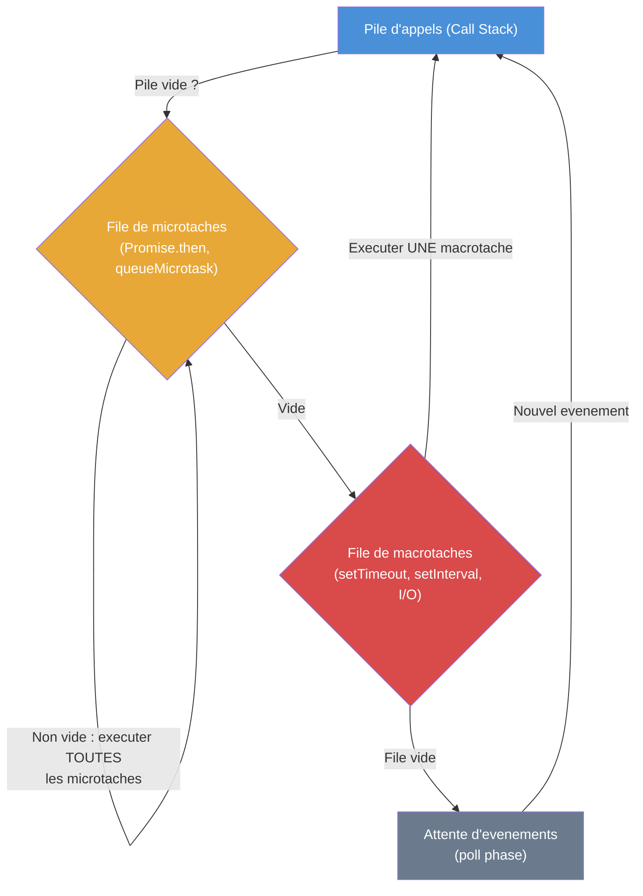

---

## 2. Pipeline OpenTelemetry (OTel)

Le Collector OTel centralise la collecte de telemetrie (traces, metriques, logs) avant de les distribuer aux backends.
L'application instrumente envoie les donnees via le SDK, le Collector les transforme puis les exporte.

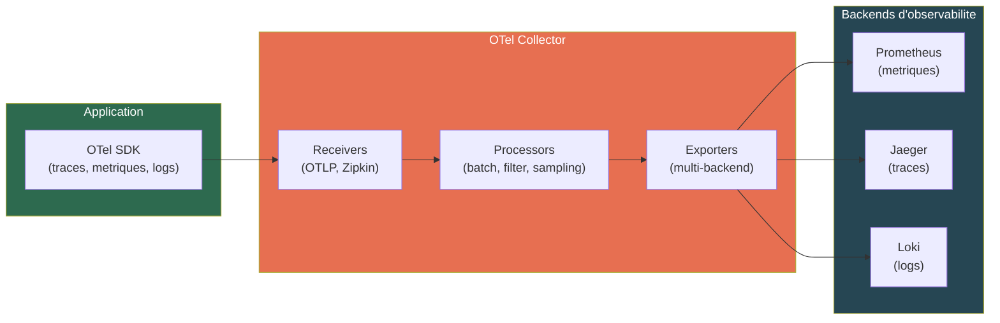

---

## 3. Architecture NestJS — Cycle de vie d'une requete

NestJS applique une serie de couches (middleware, guards, interceptors, pipes) avant et apres le handler.
L'ordre est deterministe et chaque couche a une responsabilite unique (authentification, validation, transformation).

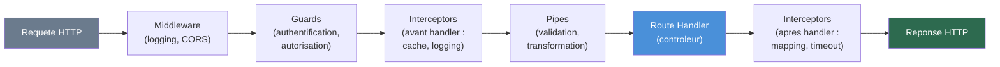

---

## 4. OAuth2 — Authorization Code Flow

Le flux Authorization Code est le plus securise pour les applications web avec backend.
Le code d'autorisation est echange cote serveur contre des tokens, evitant l'exposition du secret client.

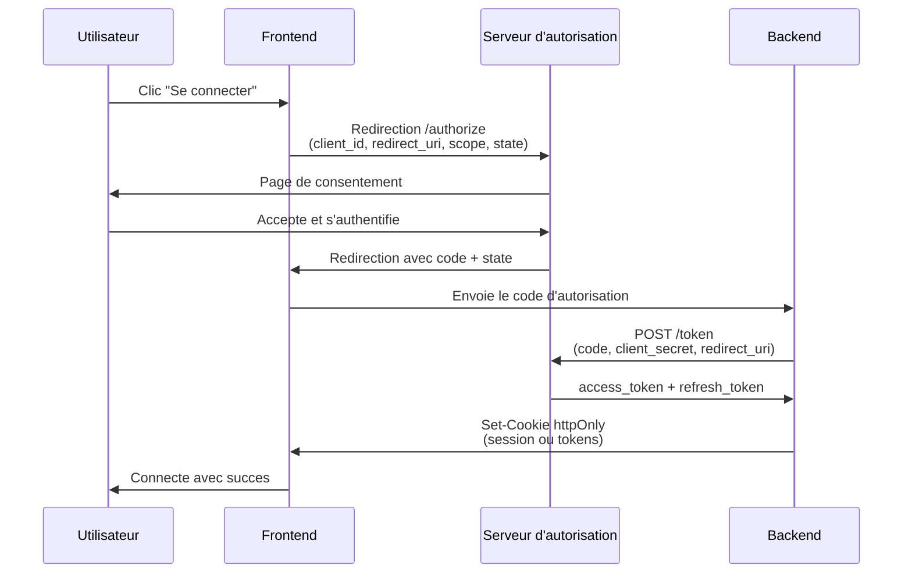

---

## 5. Saga Pattern — Choregraphie

En choregraphie, chaque service ecoute les evenements et declenche l'etape suivante ou sa compensation.
En cas d'echec, les transactions compensatoires annulent les etapes precedentes en ordre inverse.

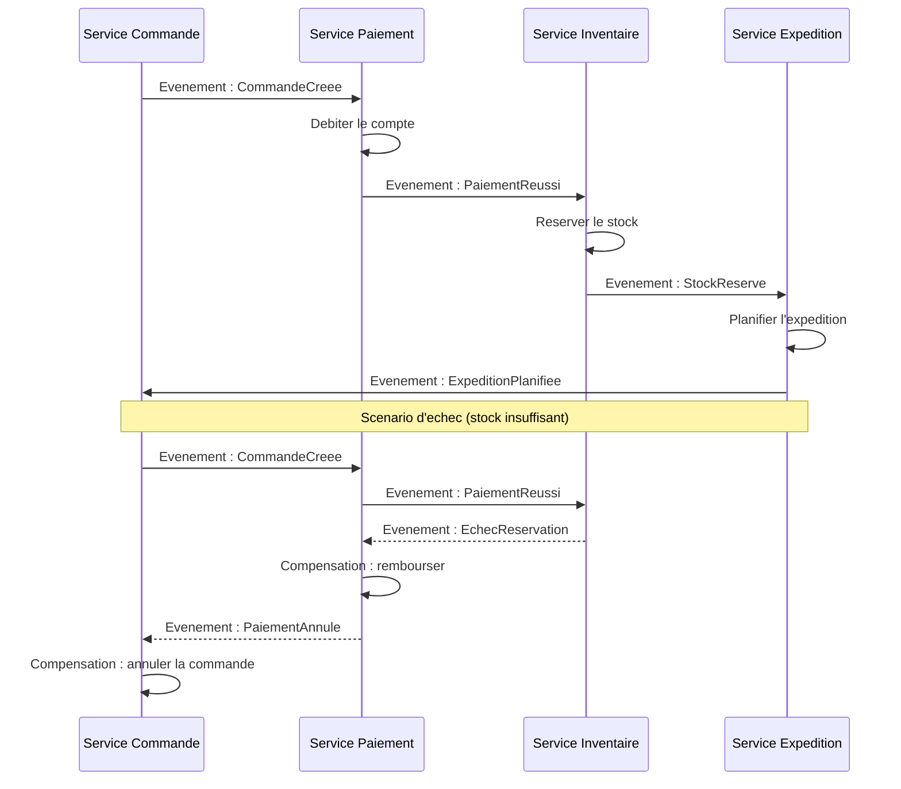

---

## 6. Cache-Aside Pattern

Le pattern Cache-Aside place le cache (Redis) devant la base de donnees pour reduire la latence.
L'application verifie d'abord le cache ; en cas de miss, elle interroge la DB puis alimente le cache avec un TTL.

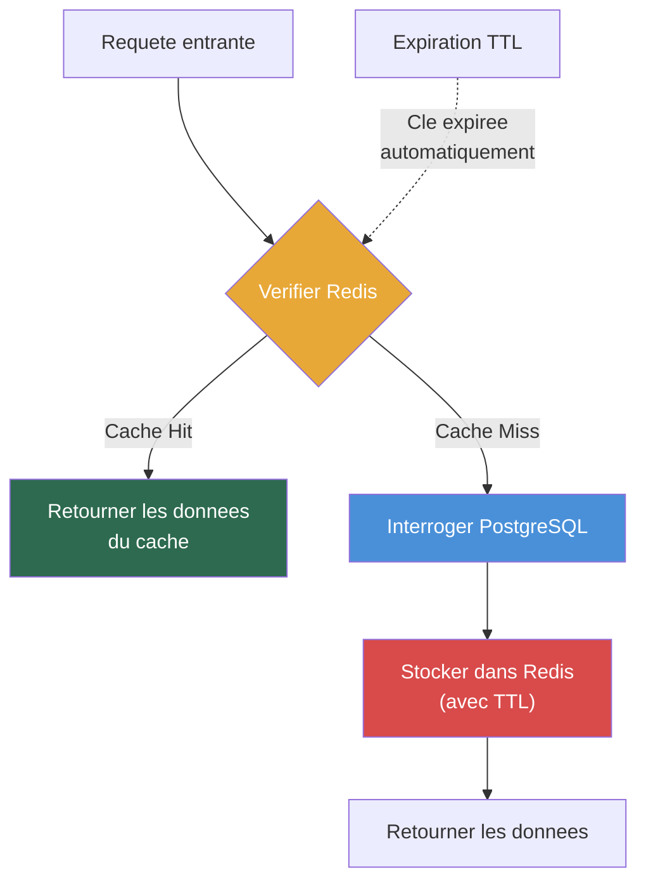

---

## 7. React Reconciliation (Diffing du Virtual DOM)

React utilise un arbre virtuel (VDOM) pour minimiser les manipulations couteuses du DOM reel.
Apres un changement d'etat, React compare l'ancien et le nouveau VDOM puis applique uniquement les differences.

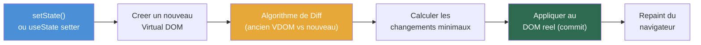

---

## 8. Pipeline CI/CD

Le pipeline CI/CD automatise la verification, la construction et le deploiement du code.
Les etapes de lint et tests unitaires tournent en parallele pour accelerer le feedback.

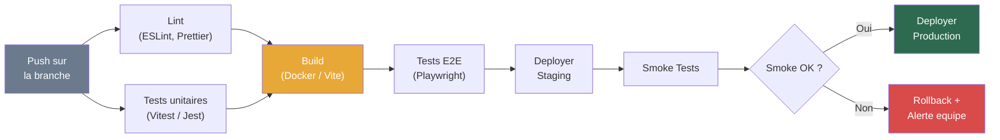

---

## 9. PostgreSQL MVCC (Multi-Version Concurrency Control)

MVCC permet aux transactions concurrentes de lire des versions differentes d'une meme ligne sans se bloquer.
Chaque transaction voit un snapshot coherent de la base au moment ou elle a commence.

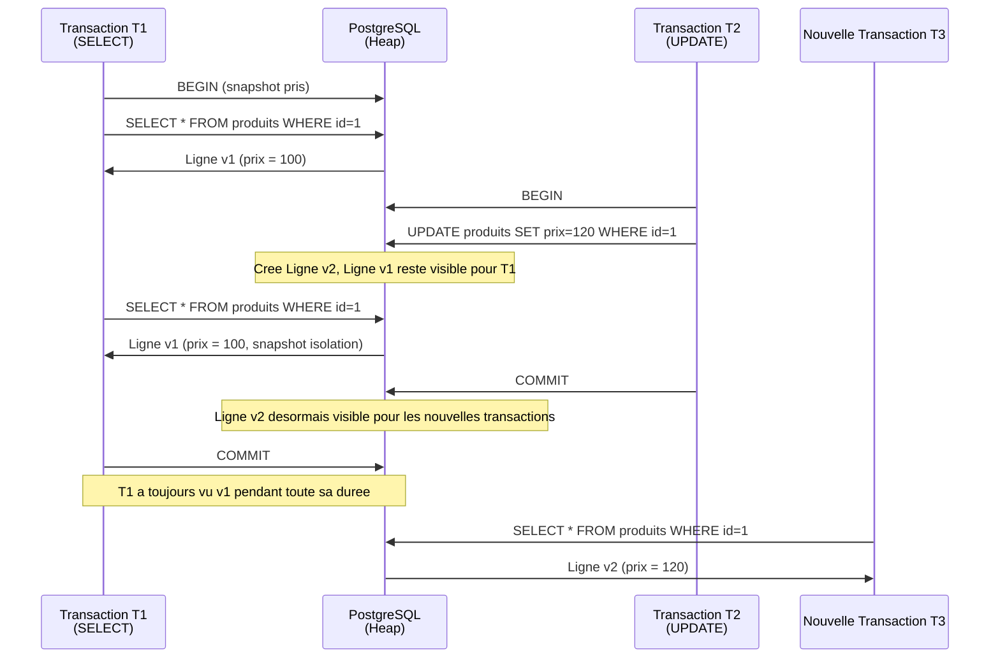

---

## 10. WebSocket + Redis Pub/Sub (Synchronisation temps reel)

Redis Pub/Sub permet de synchroniser les messages WebSocket entre plusieurs instances de serveur.
Quand un client envoie un message, il est publie dans Redis puis diffuse a tous les serveurs abonnes.

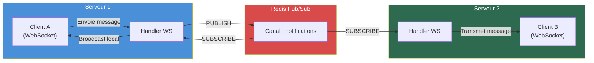

---

## 11. SLO et Budget d'Erreurs

Le budget d'erreurs quantifie la marge d'indisponibilite acceptable avant de geler les deploiements.
Avec un SLO de 99.9%, on dispose de 43 minutes d'erreur par mois (30 jours).

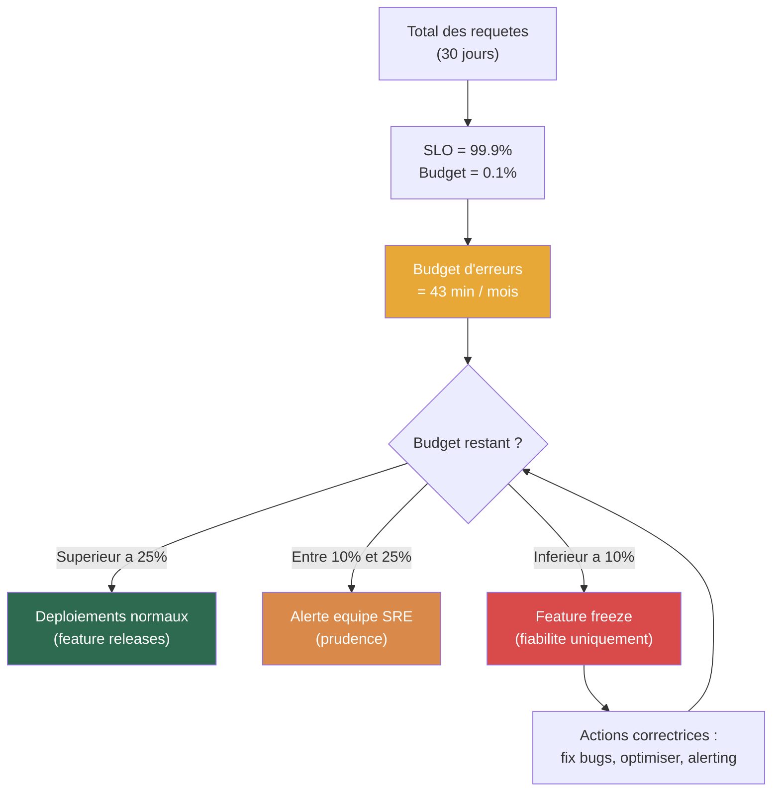

---

## 12. JWT Auth Flow (Access + Refresh Tokens)

Le access token (courte duree, 15 min) est utilise pour chaque requete authentifiee.
Le refresh token (longue duree, 7 jours, httpOnly cookie) permet de renouveler le access token sans re-authentification.

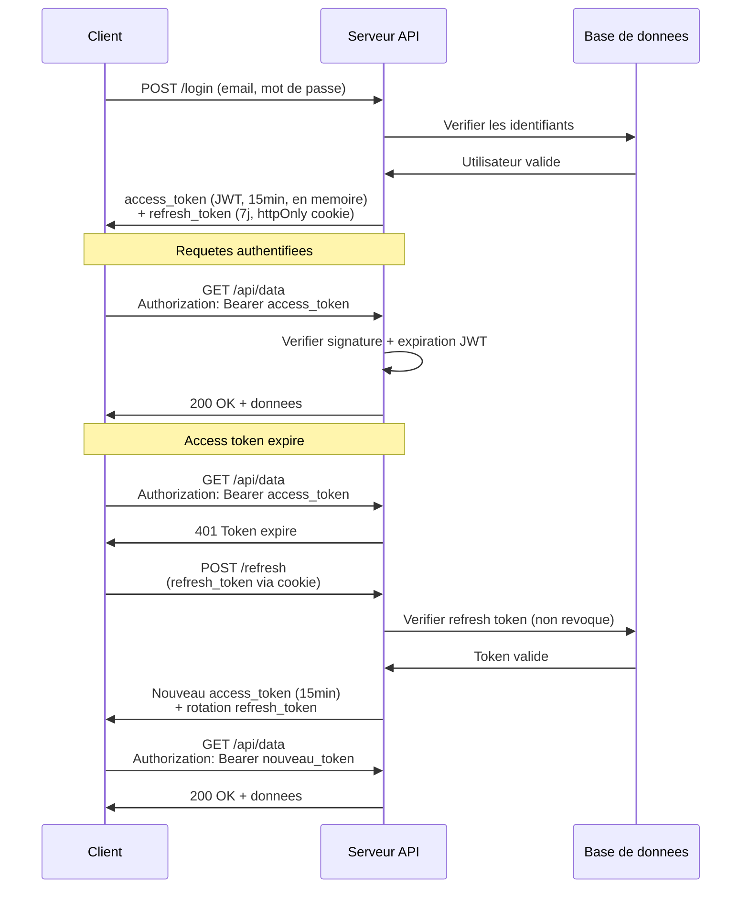
